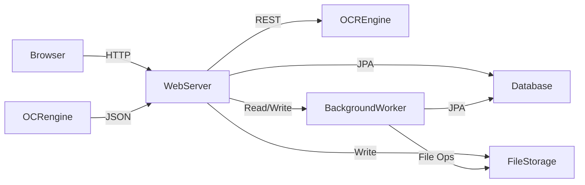

# Architecture Overview

## 1. Introduction
This document provides a high-level overview of the system architecture for the household-expense tracker application. It outlines the main components, data flow, deployment topology, and key technical considerations.

## 2. System Components

### 2.1 Client (Browser)
- **Type**: Web browser (desktop/tablet)
- **Responsibilities**:
    - Display server-side rendered pages (Thymeleaf templates)
    - Handle user interactions (form submissions, uploads, navigation)
    - Minimal JavaScript for dynamic UI elements

### 2.2 Web Server
- **Framework**: Kotlin + Spring Boot
- **Rendering**: Thymeleaf for server-side rendering
- **Responsibilities**:
    - Authentication (OAuth2 with Google)
    - Receipt and Bill ingestion API (folder-watcher service + file upload endpoints)
    - OCR orchestration (dispatch to selected AI engine)
    - CRUD operations for Bills, Receipts, Payments, Service Providers, Payment Methods
    - Settings management (OCR keys, folder paths)
    - API endpoints for table data and exports

### 2.3 OCR Engine Integration
- **Supported Engines**: OpenAI, Claude, Google AI
- **Configuration**: API keys stored & encrypted in Settings
- **Dispatcher**: Pluggable Spring beans that route requests to the active engine
- **Workflow**:
    1. File arrives in Inbox
    2. Web Server sends file to OCR engine via REST API
    3. OCR engine returns JSON with extracted fields
    4. Web Server processes JSON, persists preliminary data

### 2.4 Database
- **Primary**: PostgreSQL (Production), H2 in-memory (Development/Testing)
- **Schema**: Comprehensive domain model with the following entities:
  - **User Management**: User, LoginEvent
  - **File Ingestion**: IncomingFile (for folder-watcher detected files)
  - **Core Domain**: ServiceProvider, PaymentMethod, Bill, Receipt, Payment
  - **Future**: Attachment (planned)
- **Access Layer**: Spring Data JDBC with JdbcTemplate custom repository implementations
- **Migration**: Liquibase for schema versioning and database migrations
- **Validation**: Jakarta Bean Validation for entity constraints
- **Backup**: Scheduled SQL dumps

#### 2.4.1 Entity Relationships
- **Users** → LoginEvents (one-to-many)
- **Users** → IncomingFiles (one-to-many)
- **Users** → Bills (one-to-many) 
- **Users** → Receipts (one-to-many)
- **Users** → Payments (one-to-many)
- **Bills** → Receipts (one-to-many, optional)
- **Bills** → Payments (one-to-one, optional)
- **ServiceProviders** → Payments (one-to-many)
- **PaymentMethods** → Payments (one-to-many)

### 2.5 File Storage
- **Location**: Host filesystem within Docker volume
- **Structure**:
    - `/data/inbox` for incoming receipts (monitored by folder-watcher service)
    - `/data/attachments` for processed documents in format `yyyy-MM-dd-filename`
- **Features**:
    - **Automatic duplicate detection** via SHA-256 checksums
    - **Conflict resolution** with incremental suffixes (-1, -2, etc.)
    - **Date-organized naming** for easy file management
- **Backup**: Filesystem snapshots alongside DB dumps

### 2.6 Folder-Watcher Service
- **Implementation**: Spring Boot scheduled tasks with `@Scheduled` annotation
- **Responsibilities**:
    - **Automated File Detection**: Polls `/data/inbox` directory every 30 seconds
    - **File Processing**: Moves files to storage and creates `IncomingFile` entities
    - **Duplicate Prevention**: SHA-256 checksum-based duplicate detection
    - **Error Handling**: Comprehensive logging and graceful error recovery
- **Workflow**:
    1. Scan inbox directory for new files
    2. Validate file format and readability
    3. Calculate SHA-256 checksum for duplicate detection
    4. Move file to attachments with date-prefixed naming
    5. Create `IncomingFile` entity in PENDING status
    6. Files ready for OCR processing and user review

## 3. Data Flow

1. **Receipt/Bill Ingestion**:
    - User uploads via UI or drops into watched folder
    - File saved to `FileStorage`
    - WebServer enqueues OCR job for the `Receipt`.

2. **Receipt/Bill Association (New Step)**:
    - Ingested `Receipt`s can be associated with an existing `Bill` or used to create a new `Bill`.

2. **OCR & Extraction**:
    - WebServer calls external OCR engine
    - Parses response and persists to `Database`

3. **Review & Approval**:
    - User edits/extracts data via UI
    - Bills can be associated with Receipts for better organization
    - On approval, Bill → Payment entry created in `Database`

## 4. Deployment Topology

- **Containers** (Docker Compose/Kubernetes):
    - `app`: Spring Boot application
    - `db`: PostgreSQL or SQLite
    - `worker`: (Optional) background task processor
- **Volume Mounts**:
    - `./data/inbox:/data/inbox`
    - `./data/attachments:/data/attachments`
- **Networking**:
    - Internal Docker network; `app` connects to `db`
    - Expose `app` on port 8080 (mapped to host)

## 5. CI/CD Pipeline
- **Build**: GitHub Actions builds Docker image on push to `main`
- **Test**: Execute unit & integration tests (80%+ coverage)
- **Publish**: Tag and push images to container registry
- **Deploy**: Automated rollout to staging; manual approval for production

## 6. Scalability & Reliability
- **Stateless App**: Scale `app` horizontally behind a load balancer
- **Database**: Vertical scaling or read replicas for PostgreSQL
- **Storage**: Shared network file system or object storage for attachments
- **Backups**: Automated daily DB dumps and filesystem snapshots

## 7. Security Considerations
- **Auth**: OAuth2/OIDC via Google; no passwords stored
- **User Management**: Automatic user provisioning on first login
- **Session Tracking**: Login events logged with timestamps and IP addresses
- **Encryption**: API keys encrypted at rest
- **Auditing**: Soft-deletes and action logging for all entities
- **Network**: TLS termination at ingress/load balancer

## 8. Monitoring & Logging
- **App Metrics**: Expose via Actuator endpoints (CPU, memory, response times)
- **Logs**: Centralized logging with ELK or similar stack
- **Alerts**: Trigger on high error rates or resource exhaustion

## 9. Technology Stack
| Layer             | Technology                         |
|-------------------|------------------------------------|
| Language          | Kotlin                             |
| Framework         | Spring Boot + Thymeleaf SSR        |
| Database          | PostgreSQL (prod), H2 (dev/test)   |
| ORM/Data Access   | Spring Data JDBC + JdbcTemplate    |
| Validation        | Jakarta Bean Validation            |
| OCR Engines       | OpenAI, Claude, Google AI          |
| Containerization  | Docker Compose / Kubernetes        |
| CI/CD             | GitHub Actions                     |

## 10. Future Enhancements
- **Microservices**: Split OCR, ingestion, and review into separate services
- **Bank Integrations**: Connect to financial APIs for automatic transactions
- **Notifications**: Email/SMS reminders for upcoming recurrent payments
