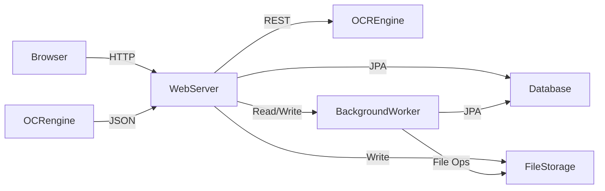

# Architecture Overview

## 1. Introduction
This document provides a high-level overview of the system architecture for the household-expense tracker application. It outlines the main components, data flow, deployment topology, and key technical considerations.

## 2. System Components

### 2.1 Client (Browser)
- **Type**: Web browser (desktop/tablet)
- **Responsibilities**:
    - Display server-side rendered pages (Thymeleaf templates)
    - Handle user interactions (form submissions, uploads, navigation)
    - Minimal JavaScript for dynamic UI elements

### 2.2 Web Server
- **Framework**: Kotlin + Spring Boot
- **Rendering**: Thymeleaf for server-side rendering
- **Responsibilities**:
    - Authentication (OAuth2 with Google)
    - Receipt and Bill ingestion API (folder-watcher service + file upload endpoints)
    - ✅ **Inbox Management**: File review interface with thumbnails, status management, and OCR operations
    - ✅ **File Serving**: Secure file access with thumbnail generation and MIME type handling
    - ✅ **OCR Orchestration**: Complete workflow automation with multi-engine support
    - ✅ **OCR Interface**: Comprehensive UI for managing OCR processing, retries, and dispatch
    - CRUD operations for Bills, Receipts, Payments, Service Providers, Payment Methods
    - ✅ **Detail Views**: Split-pane interfaces with two-tab design for file processing with OCR integration
    - ✅ **Enhanced Panel Actions**: Manual type selection workflow with Bill/Receipt conversion buttons
    - ✅ **Entity Conversion System**: Seamless conversion between IncomingFile ↔ Bill ↔ Receipt with revert functionality
    - ✅ **OCR History Tracking**: Complete audit trail of all OCR processing attempts across entity transitions
    - Settings management (OCR keys, folder paths)
    - API endpoints for table data and exports

### 2.3 OCR Engine Integration ✅ **IMPLEMENTED**
- **Supported Engines**: OpenAI GPT-4 Vision, Claude (Anthropic) Vision, Google Gemini Vision, STUB (development)
- **Configuration**: API keys configurable via environment variables
- **Architecture**: Multi-engine support with fallback mechanisms and conditional bean creation
- **Processing**: Synchronous processing with real-time progress feedback
- **Development Support**: STUB engine provides random OCR results when no real engines configured
- **Workflow**: ✅ **COMPLETE END-TO-END IMPLEMENTATION**
    1. File upload/detection triggers automatic OCR processing
    2. IncomingFileOcrService orchestrates the processing workflow
    3. Status transitions: NEW → APPROVED/REJECTED (processing state removed)
    4. OcrService selects and invokes available OCR engines with STUB fallback
    5. Results stored in IncomingFile entity with extracted data
    6. Unknown service providers trigger manual input dialog with retry options
    7. FileDispatchService converts approved files to Bill entities
    8. UI provides synchronous processing with modal progress indicators
    9. Bill/Receipt detail views open immediately after OCR completion
    9. Bill/Receipt detail views open immediately after OCR completion

### 2.4 Database
- **Primary**: PostgreSQL (Production), H2 in-memory (Development/Testing)
- **Schema**: Comprehensive domain model with the following entities:
  - **User Management**: User, LoginEvent
  - **File Ingestion**: IncomingFile (complete OCR workflow integration with extracted data fields)
  - **Core Domain**: ServiceProvider, PaymentMethod, Bill, Receipt, Payment
  - **Status Model**: ItemStatus enum (NEW, APPROVED, REJECTED) with legacy status consolidation
  - **OCR Audit**: OcrAttempt (complete history of all OCR processing attempts)
  - **Future**: Attachment (planned)
- **Access Layer**: Spring Data JDBC with JdbcTemplate custom repository implementations
- **Migration**: Liquibase for schema versioning and database migrations
- **Validation**: Jakarta Bean Validation for entity constraints
- **Backup**: Scheduled SQL dumps

#### 2.4.1 Entity Relationships
- **Users** → LoginEvents (one-to-many)
- **Users** → IncomingFiles (one-to-many)
- **Users** → Bills (one-to-many) 
- **Users** → Receipts (one-to-many)
- **Users** → Payments (one-to-many)
- **Users** → OcrAttempts (one-to-many)
- **Bills** → Receipts (one-to-many, optional)
- **Bills** → Payments (one-to-one, optional)
- **Bills** → IncomingFiles (via originalIncomingFileId)
- **Receipts** → IncomingFiles (via originalIncomingFileId)
- **ServiceProviders** → Payments (one-to-many)
- **PaymentMethods** → Payments (one-to-many)
- **OcrAttempts** → IncomingFiles/Bills/Receipts (polymorphic via entityType/entityId)

### 2.5 File Storage
- **Location**: Host filesystem within Docker volume
- **Structure**:
    - `/data/inbox` for incoming receipts (monitored by folder-watcher service)
    - `/data/attachments` for processed documents in format `yyyy-MM-dd-filename`
- **Features**:
    - **Automatic duplicate detection** via SHA-256 checksums
    - **Conflict resolution** with incremental suffixes (-1, -2, etc.)
    - **Date-organized naming** for easy file management
- **Backup**: Filesystem snapshots alongside DB dumps

### 2.6 Folder-Watcher Service
- **Implementation**: Spring Boot scheduled tasks with `@Scheduled` annotation
- **Responsibilities**:
    - **Automated File Detection**: Polls `/data/inbox` directory every 30 seconds
    - **File Processing**: Moves files to storage and creates `IncomingFile` entities
    - **Duplicate Prevention**: SHA-256 checksum-based duplicate detection
    - **Error Handling**: Comprehensive logging and graceful error recovery
- **Enhanced Workflow with OCR**: ✅ **IMPLEMENTED**
    1. Scan inbox directory for new files
    2. Validate file format and readability
    3. Calculate SHA-256 checksum for duplicate detection
    4. Move file to attachments with date-prefixed naming
    5. Create `IncomingFile` entity in PENDING status
    6. **Automatic OCR Processing**: Trigger OCR processing immediately with STUB fallback
    7. **Status Management**: Update to PROCESSING → APPROVED/REJECTED
    8. **Data Extraction**: Store extracted provider, amount, date, currency
    9. **Unknown Provider Handling**: Manual input dialog for unknown service providers
    10. **Immediate Navigation**: Automatic detail view opening after OCR completion
    11. Files ready for user review and bill dispatch

### 2.7 Inbox Management System ✅ **REDESIGNED WITH SIDEBAR NAVIGATION**
- **Architecture**: Sidebar navigation interface with tab-based entity filtering and unified table display
- **Components**:
    - **InboxController**: Web and API controller for tabbed inbox functionality
    - **IncomingFileService**: Business logic layer with status-based filtering
    - **BillService**: Business logic for bill status management
    - **ReceiptService**: Business logic for receipt status management
    - **FileServingController**: Secure file access with user authentication
    - **ThumbnailService**: On-demand thumbnail generation for images and PDFs
- **Features**: ✅ **SIDEBAR NAVIGATION WITH UNIFIED TABLE**
    - **Sidebar Navigation**: Left sidebar with tabs (Inbox, Bills, Receipts, Service Provider tabs)
    - **Unified Table**: Right panel table showing entities based on selected tab
    - **Dynamic Service Provider Tabs**: Automatically created tabs for each provider with associated items
    - **Status Consolidation**: Legacy statuses (pending, processing, draft) consolidated to NEW
    - **Inbox Tab**: Shows IncomingFile, Bill, Receipt items with status=NEW
    - **Entity Tabs**: Bills/Receipts tabs show all statuses (NEW, APPROVED, REJECTED)
    - **Provider Tabs**: Show all entity types associated with specific providers
    - **OCR Status Indicators**: Real-time OCR processing status and extracted data preview
    - **Real-time Operations**: AJAX-powered status transitions and OCR operations
    - **Modal Viewer**: Full-screen file preview with keyboard shortcuts
    - **Enhanced Detail View**: Comprehensive OCR workflow management interface
    - **Security**: User-scoped access with OAuth2 authentication verification
- **Data Flow**:
    1. Users access inbox via `/inbox` endpoint with sidebar navigation interface
    2. Controller fetches user's items based on selected tab (Inbox, Bills, Receipts, Provider)
    3. Inbox tab displays IncomingFile, Bill, Receipt items with NEW status
    4. Entity tabs (Bills/Receipts) display all items with all statuses
    5. Provider tabs display all entity types associated with specific providers
    6. Unified table displays appropriate entities based on tab selection
    7. Thumbnails generated on-demand for visual preview
    8. AJAX operations handle tab switching and table data loading
    9. Detail view accessible via clicking table rows for comprehensive item information
    10. All operations verify user ownership for security

#### 2.7.1 Inbox Endpoints
- **Web Endpoints**:
    - `GET /inbox` - Main inbox page with sidebar navigation interface
    - `GET /inbox/files/{fileId}` - Detailed file view with metadata and preview
- **API Endpoints**:
    - `GET /inbox/api/sidebar-tabs/{tabName}` - Legacy sidebar tab data endpoint
    - `GET /inbox/api/tabs/provider/{providerId}` - Legacy provider tab data endpoint
    - ✅ **Tab Content Loading System** (GitHub issue #20):
        - `GET /api/inbox/tabs/inbox` - NEW status items (all entity types) with pagination support
        - `GET /api/inbox/tabs/bills` - All bills (all statuses) with pagination support
        - `GET /api/inbox/tabs/receipts` - All receipts (all statuses) with pagination support
        - `GET /api/inbox/tabs/provider/{id}` - All entities for specific provider with pagination support
    - `GET /api/service-providers/active` - Get providers with associated items
    - `GET /inbox/api/files/{fileId}/detail` - Detailed item information as JSON
    - `POST /inbox/api/files/{fileId}/approve` - Approve item status change
    - `POST /inbox/api/files/{fileId}/reject` - Reject item status change
    - `DELETE /inbox/api/files/{fileId}` - Delete item permanently
    - ✅ **OCR Operations**:
        - `POST /inbox/api/files/{fileId}/ocr` - Trigger OCR processing
        - `POST /inbox/api/files/{fileId}/ocr-retry` - Retry failed OCR processing
        - `POST /inbox/api/files/{fileId}/dispatch` - Dispatch approved files to Bills
        - `GET /inbox/api/ocr-statistics` - Get user OCR processing statistics

#### 2.7.2 Data Transfer Objects ✅ **ENHANCED WITH OCR DATA**
- **InboxFileDto**: List view file information with status, thumbnail URLs, and OCR result fields
- **InboxListResponse**: Paginated response with files and status counts
- **IncomingFileDetailDto**: Comprehensive file details with OCR data, computed fields, and action permissions
  - OCR status and processing timestamps
  - Extracted provider, amount, date information
  - Error messages for failed processing
  - Action permissions (canRetryOcr, readyForDispatch)
- **FileOperationResponse**: Standard response for file operations (approve/reject/delete/OCR)

### 2.8 Bill/Receipt Detail View System ✅ **IMPLEMENTED**
- **Architecture**: Split-pane detail processing interfaces for bills and receipts
- **Components**:
    - **BillController**: Web and API endpoints for bill detail operations
    - **ReceiptController**: Web and API endpoints for receipt detail operations  
    - **BillService**: Business logic for bill operations, OCR data handling, and approval workflow
    - **ReceiptService**: Business logic for receipt operations and bill associations
    - **PaymentService**: Payment creation from approved bills and receipts
    - **ServiceProviderService**: Management of service provider entities
    - **PaymentMethodService**: Management of payment method entities
- **Features**:
    - **Split-Pane UI**: Image viewer (left) + form interface (right)
    - **Zoomable Image Viewer**: Pan, zoom, rotate controls with responsive design
    - **OCR Data Integration**: Pre-populated forms with extracted provider, amount, and date information
    - **Service Provider Management**: Complete CRUD operations via "Edit Providers" button opening management dialog
    - **Unknown Provider Handling**: Manual input dialog for unknown providers with save/retry options
    - **Immediate Navigation**: OCR completion automatically opens appropriate detail view
    - **Bill Processing**: Approve/reject workflow with payment creation
    - **Receipt Association**: Link receipts to existing bills or create standalone payments
    - **Draft Saving**: Persist intermediate edits without approval
    - **User Security**: All operations verify user ownership and authentication
- **Data Transfer Objects**:
    - **BillDetailDto**: Complete bill information with associated receipts
    - **ReceiptDetailDto**: Receipt information with available bill associations
    - **PaymentDetailDto**: Payment information with provider/method details
    - **ServiceProviderDto**: Service provider dropdown options
    - **PaymentMethodDto**: Payment method dropdown options
- **Workflow**:
    1. Users navigate from inbox to detail views via "Detail" button
    2. Controllers load entity data and related information 
    3. Services provide business logic for associations and operations
    4. Templates render split-pane interface with image viewer and forms
    5. AJAX operations handle approve, reject, associate, and save actions
    6. Payment entities created from approved bills/receipts

## 3. Data Flow

1. **Receipt/Bill Ingestion**:
    - User uploads via UI or drops into watched folder
    - File saved to `FileStorage`
    - WebServer enqueues OCR job for the `Receipt`.

2. **Receipt/Bill Association (New Step)**:
    - Ingested `Receipt`s can be associated with an existing `Bill` or used to create a new `Bill`.

2. **OCR & Extraction**:
    - WebServer calls external OCR engine
    - Parses response and persists to `Database`

3. **Review & Approval**:
    - User edits/extracts data via UI
    - Bills can be associated with Receipts for better organization
    - On approval, Bill → Payment entry created in `Database`

## 4. Deployment Topology

- **Containers** (Docker Compose/Kubernetes):
    - `app`: Spring Boot application
    - `db`: PostgreSQL or SQLite
    - `worker`: (Optional) background task processor
- **Volume Mounts**:
    - `./data/inbox:/data/inbox`
    - `./data/attachments:/data/attachments`
- **Networking**:
    - Internal Docker network; `app` connects to `db`
    - Expose `app` on port 8080 (mapped to host)

## 5. CI/CD Pipeline
- **Build**: GitHub Actions builds Docker image on push to `main`
- **Test**: Execute unit & integration tests (80%+ coverage)
- **Publish**: Tag and push images to container registry
- **Deploy**: Automated rollout to staging; manual approval for production

## 6. Scalability & Reliability
- **Stateless App**: Scale `app` horizontally behind a load balancer
- **Database**: Vertical scaling or read replicas for PostgreSQL
- **Storage**: Shared network file system or object storage for attachments
- **Backups**: Automated daily DB dumps and filesystem snapshots

## 7. Security Considerations
- **Auth**: OAuth2/OIDC via Google; no passwords stored
- **User Management**: Automatic user provisioning on first login
- **Session Tracking**: Login events logged with timestamps and IP addresses
- **Encryption**: API keys encrypted at rest
- **Auditing**: Soft-deletes and action logging for all entities
- **Network**: TLS termination at ingress/load balancer

## 8. Monitoring & Logging
- **App Metrics**: Expose via Actuator endpoints (CPU, memory, response times)
- **Logs**: Centralized logging with ELK or similar stack
- **Alerts**: Trigger on high error rates or resource exhaustion

## 9. Technology Stack
| Layer             | Technology                         |
|-------------------|------------------------------------|
| Language          | Kotlin                             |
| Framework         | Spring Boot + Thymeleaf SSR        |
| Database          | PostgreSQL (prod), H2 (dev/test)   |
| ORM/Data Access   | Spring Data JDBC + JdbcTemplate    |
| Validation        | Jakarta Bean Validation            |
| OCR Engines       | OpenAI, Claude, Google AI, STUB    |
| Containerization  | Docker Compose / Kubernetes        |
| CI/CD             | GitHub Actions                     |

## 10. Future Enhancements
- **Microservices**: Split OCR, ingestion, and review into separate services
- **Bank Integrations**: Connect to financial APIs for automatic transactions
- **Notifications**: Email/SMS reminders for upcoming recurrent payments
