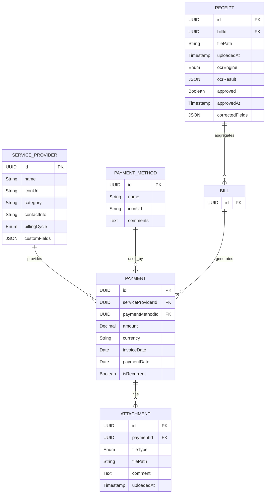

# Project Requirements Document

## 1. Document Control
| Version | Date       | Author            | Changes               |
|---------|------------|-------------------|-----------------------|
| 1.0     | 2025-07-02 | Product Manager   | Initial draft         |

## 2. Purpose & Scope
**Purpose**  
Enable individuals and families to digitize, review, and manage household (and other) expenses via receipt and bill images, automated OCR extraction, manual approval, and rich reporting.

**Scope**
- Receipt and Bill ingestion (watch folder + web UI)
- OCR via OpenAI, Claude, Google AI
- Manual review & approval for Receipts and Bills
- Association of Receipts with Bills
- Payment record management (one-off & recurring)
- Attachments & comments
- Reporting & exports (CSV/Excel)
- Admin settings (OCR engines, API keys)

## 3. Objectives & Success Metrics
- **Accuracy**: ≥ 95% of mandatory fields correctly extracted by OCR
- **Throughput**: Ingestion to inbox display ≤ 10 seconds
- **Adoption**: 80% of users schedule at least one recurring payment tab
- **Retention**: 70% monthly active users after 3 months

## 5. User Personas
| Persona                    | Description                                      | Goals                                             |
|----------------------------|--------------------------------------------------|---------------------------------------------------|
| Individual Household Member| Tech-savvy adult managing personal bills         | Quickly log & categorize receipts; monitor spend  |
| Family Head                | Oversees family finances                         | Ensure all recurring bills are paid on time       |

## 6. User Scenarios & Stories
1. **Ingest Receipt/Bill**
    - *As a user*, I want to drop my receipt or bill into a watched folder or upload via UI so that I don’t have to manually enter data.
2. **Review Extraction**
    - *As a user*, I want to edit or approve OCR-extracted data from receipts or bills to ensure accuracy before payment.
3. **Associate Receipt with Bill**
    - *As a user*, I want to associate one or more receipts with a specific bill, or create a new bill from a receipt.
4. **Record a Payment**
    - *As a user*, I want approved bills (which may be composed of one or more receipts) to appear in a payments panel where I can mark them as paid later.
5. **Manage Recurring Bills**
    - *As a user*, I want to create “tabs” per provider so I can see months with missing payments.
6. **Attach Documents**
    - *As a user*, I want to upload PDFs or images to an existing payment and add comments for context.
7. **Generate Reports**
    - *As a user*, I want to export monthly and yearly spend by provider to Excel for my records.

## 7. Functional Requirements

### 7.1 Receipt and Bill Ingestion & Inbox
- **Folder Watcher**
    - Poll a configurable path (e.g. `/data/inbox`) every 30 s
    - Supported file types: `.jpg`, `.png`, `.pdf`
    - Ingested files type should be guessed by ocr
- **Web UI Upload**
    - Drag-and-drop area + “Browse…” button
    - Progress indicator and success/failure toast
    - Ingested files type should be guessed by ocr

### 7.2 OCR Processing & Settings
- **Engines**: OPENAI, CLAUDE, GOOGLE_AI
- **Settings Page**
    - Toggle engines on/off
    - Fields for API keys (stored encrypted)
    - Select default OCR engine
- **Processing Workflow**
    1. File lands in inbox → assigned to active engine
    2. Response JSON parsed into fields
    3. Guess `serviceProvider`; flag ambiguous

### 7.3 Receipt and Bill Review & Approval
- **Inbox List View**
    - Columns: Thumbnail, Filename, UploadedAt, Provider (if guessed), Status
    - Click row opens Detail View for either a Receipt or a Bill.
- **Receipt Detail View**
    - **Left Pane**: Full-size receipt image (zoomable)
    - **Right Pane**: Form with OCR-populated fields:
        - Service Provider (autocomplete + icon)
        - Payment Method (dropdown)
        - Amount, Currency
        - Invoice Date, Payment Date
        - Recurrent (checkbox)
        - Custom Provider Fields
    - Actions:
        - **Associate with Bill**: Link this receipt to an existing bill or create a new bill.
        - **Accept as Payment**: Approve and move to Payments (for standalone receipts).
        - **Save Draft**: Persist edits, remain in Inbox.
- **Bill Detail View**
    - **Left Pane**: List of associated receipts with thumbnails (clickable to view Receipt Detail).
    - **Right Pane**: Aggregated form fields for the Bill:
        - Service Provider (autocomplete + icon)
        - Payment Method (dropdown)
        - Amount, Currency (aggregated from receipts or manually entered)
        - Invoice Date, Payment Date
        - Recurrent (checkbox)
        - Custom Provider Fields
    - Actions:
        - **Accept** (approve and move to Payments)
        - **Save Draft** (persist edits, remain in Inbox)

### 7.4 Payments Management
- **Payments Table**
    - Columns: Provider, Method, Amount, Currency, InvoiceDate, PaymentDate, Recurrent
    - Features: sortable columns, pagination
- **Filters & Search**
    - By Provider, Method, DateRange, Status (Paid/Unpaid), Recurrent
- **Bulk Actions**
    - Mark as Paid/Unpaid, Export selection
- **Totals Bar**
    - Display sum of filtered amounts at bottom

### 7.5 Recurring Payments & Tabs
- **Create Tab**
    - Left-sidebar button opens modal to select a Service Provider
    - Creates persistent tab that lists all payments for that provider
- **Tab View**
    - Calendar-style grid or table: highlight months with no `PaymentDate`
    - Option to mark expected payments as “Skipped”

### 7.6 Attachments Management
- **On Payment Detail**
    - “Add Attachment” button → upload PDF/Image
    - List of attachments with thumbnail, filename, upload date, comment
    - Edit/Delete comment

### 7.7 Reporting & Export
- **Predefined Reports**
    - Monthly Spend by Provider
    - Yearly Spend by Provider
- **Custom View Export**
    - Any filtered table → “Export” → choose CSV or Excel
- **Excel Template**
    - Header row with human-readable column names
    - Data rows matching table sort order

### 7.8 Settings & Configuration
- **General**
    - OAuth Google client configuration
    - Folder paths for ingestion & attachments
- **OCR**
    - Engine toggles, API key inputs
- **Database**
    - Select DB type: PostgreSQL (prod) or SQLite (dev)

## 8. Non-Functional Requirements

| Category        | Requirement                                                   |
|-----------------|---------------------------------------------------------------|
| Performance     | Inbox listing ≤ 200 ms; 95th-percentile page load ≤ 1 s       |
| Scalability     | Support up to 1 M receipts and bills and 100 K payments       |
| Security        | OAuth2 via Google; encrypt API keys at rest; soft-delete only |
| Reliability     | 99.5% uptime; daily backups of DB & filesystem                |
| Maintainability | 80% unit test coverage; modular Spring beans for OCR engines  |
| Usability       | WCAG AA accessibility; responsive to desktop/tablet           |

## 9. Data Model

## 10. System Architecture

### 10.1 High-Level

\`\`\`
Browser
│
▼
[Spring Boot + Thymeleaf SSR]───[Filesystem for uploads]
│
└───[PostgreSQL / SQLite]
\`\`\`

### 10.2 Deployment
- **Containers**: Docker Compose (app + db)
- **Environments**: Dev (SQLite), Staging (PostgreSQL), Prod (PostgreSQL)
- **CI/CD**: GitHub Actions to build, test, push images

## 11. UI/UX Wireframes (Concept)
1. **Inbox List**: table with thumbnails + status badges
2. **Detail View**: split-pane, image zoom + form
3. **Payments**: Excel-style grid, filter bar on top, totals bar below
4. **Tabs Panel**: collapsible left sidebar with “Create Tab” + list of tabs

## 12. Acceptance Criteria & Test Cases

### 12.1 Bill Ingestion
- Drop a JPEG into watch folder → appears in Inbox within 30 s
- Upload via UI → success toast + new row

### 12.2 OCR & Review
- OCR populates at least {serviceProvider, amount, date}
- Ambiguous provider triggers user prompt
- “Accept” moves record to Payments; “Save Draft” does not

### 12.3 Payments & Recurrence
- Table filters by each column correctly
- Creating a tab persists after restart
- Missing months are highlighted

### 12.4 Attachments
- Upload PDF to payment → thumbnail + comment field displayed
- Deleting comment updates display

### 12.5 Reports & Export
- CSV opens in Excel with correct headers
- Monthly spend report matches sum of payments

## 13. Assumptions & Constraints
- Users have a Google account for OAuth
- OCR accuracy depends on external APIs (beyond our control)
- Initial version excludes bank-API integrations & notifications

## 14. Glossary
- **OCR**: Optical Character Recognition
- **SSR**: Server-Side Rendering
- **MVP**: Minimum Viable Product  
